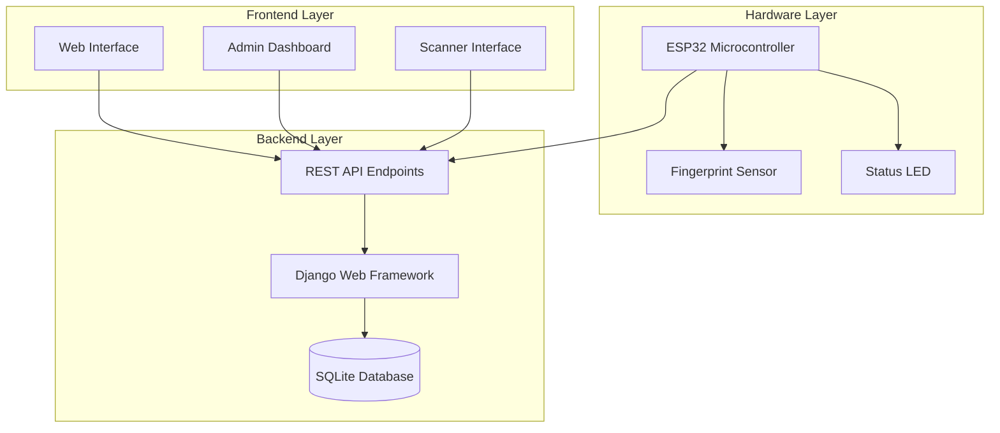
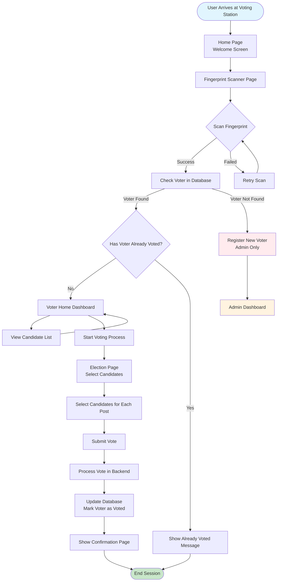
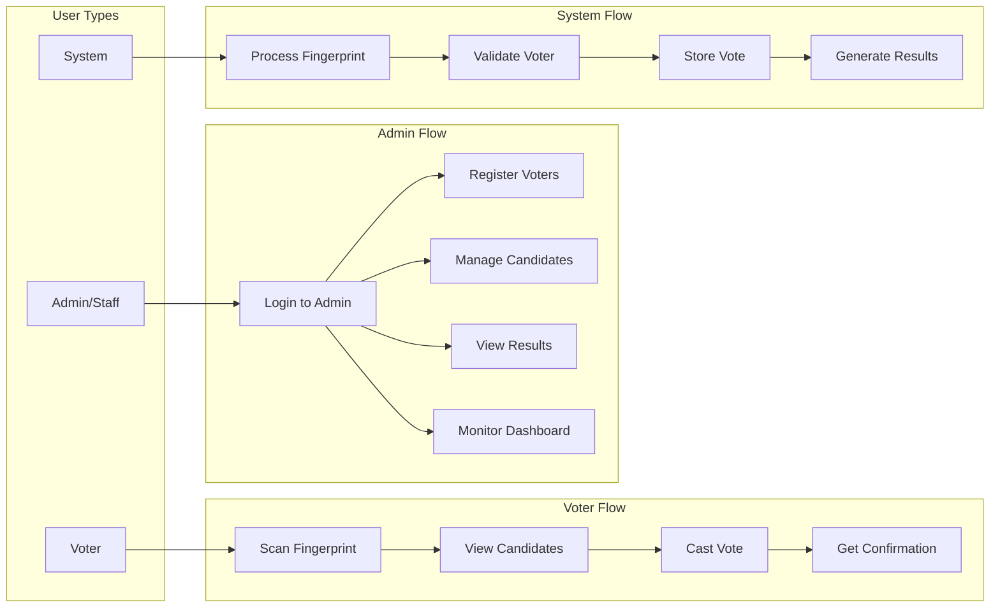
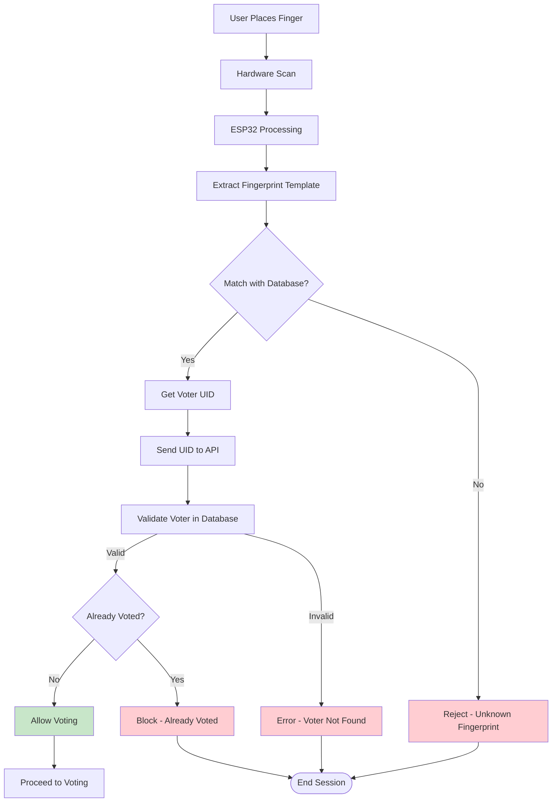
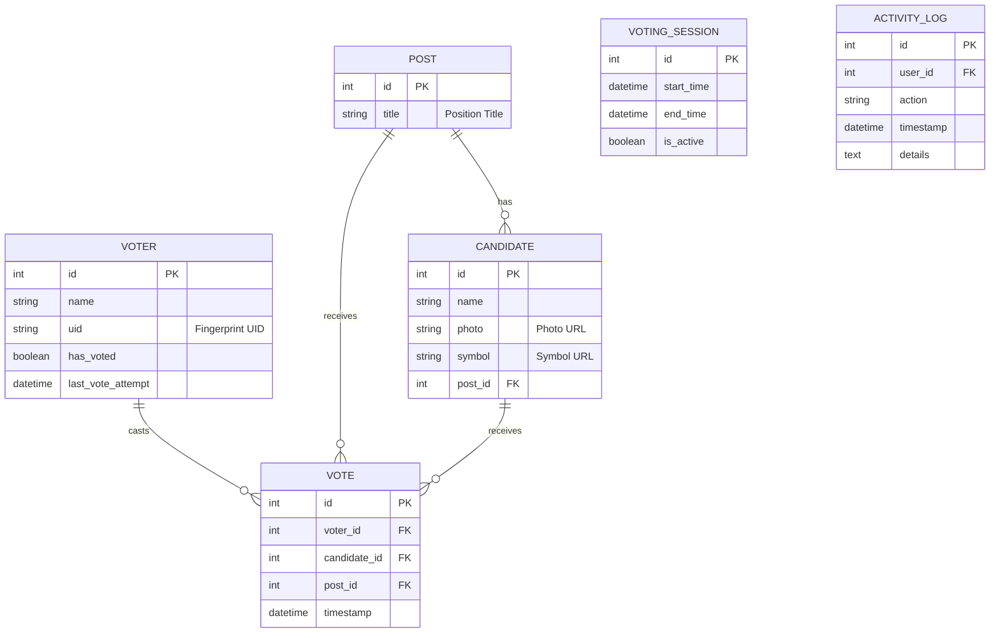
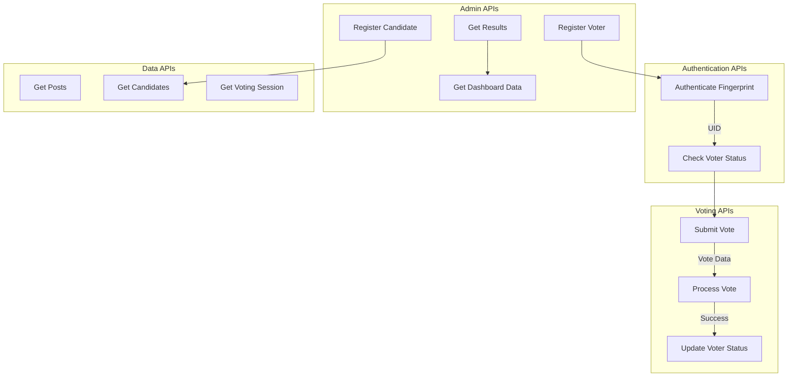
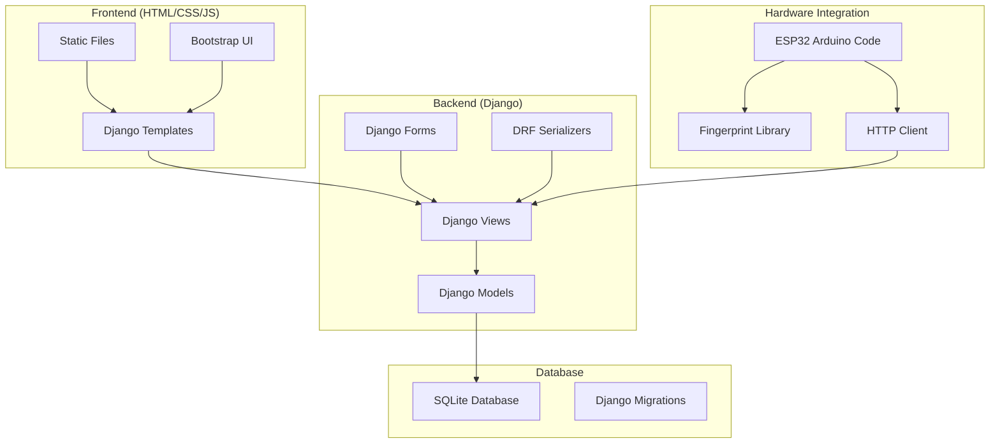
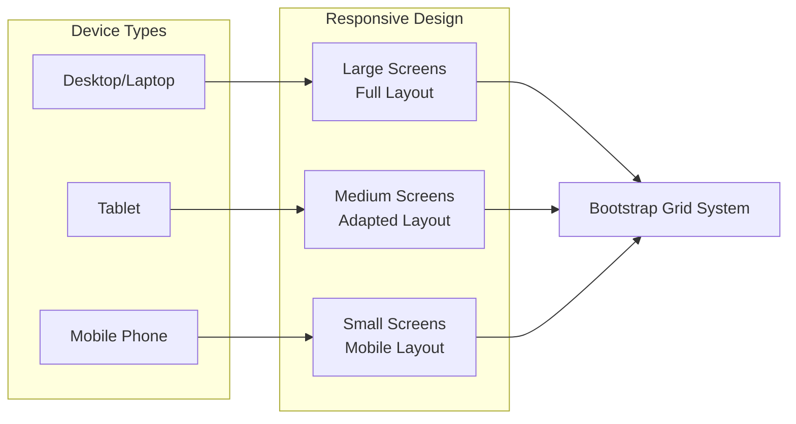
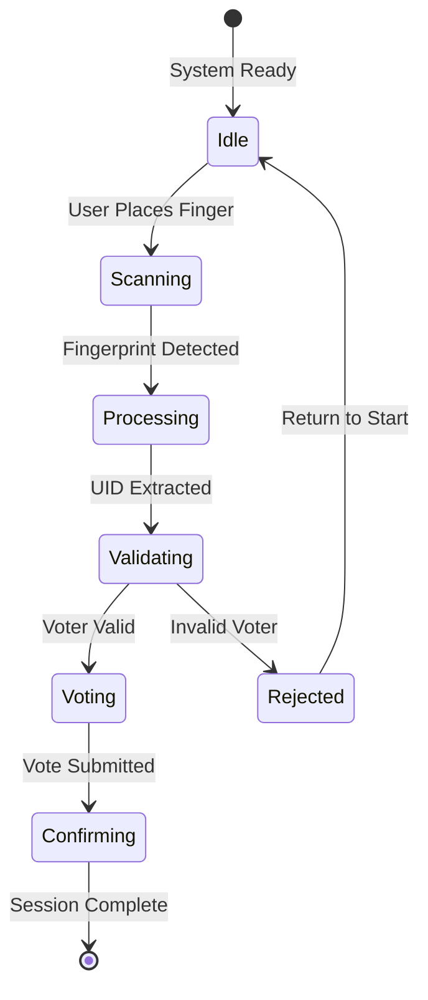

# Digital Voting System via Fingerprint - System Flow Chart

## 🏗️ System Architecture Overview

## 🔄 Complete User Flow

## 👥 User Roles & Access Flow

## 🔐 Authentication & Security Flow

## 📊 Data Flow & Database Schema

## 🚀 API Endpoints Flow

## 🔧 Technical Implementation Flow

## 📱 Mobile Responsive Flow

## 🎯 Key Features & Benefits

### ✅ **Security Features**
- Biometric authentication via fingerprint
- One-time voting per voter
- Real-time vote validation
- Audit trail with activity logs

### ✅ **User Experience**
- Simple and intuitive interface
- Real-time feedback
- Mobile responsive design
- Multi-language support (ready for future)

### ✅ **Administrative Features**
- Voter registration management
- Candidate management
- Real-time results monitoring
- Comprehensive dashboard

### ✅ **Technical Features**
- RESTful API architecture
- Scalable database design
- Hardware integration ready
- Cross-platform compatibility

## 🔄 System States

This flow chart provides a comprehensive overview of your Digital Voting System, showing how all components work together to create a secure, user-friendly voting experience. 